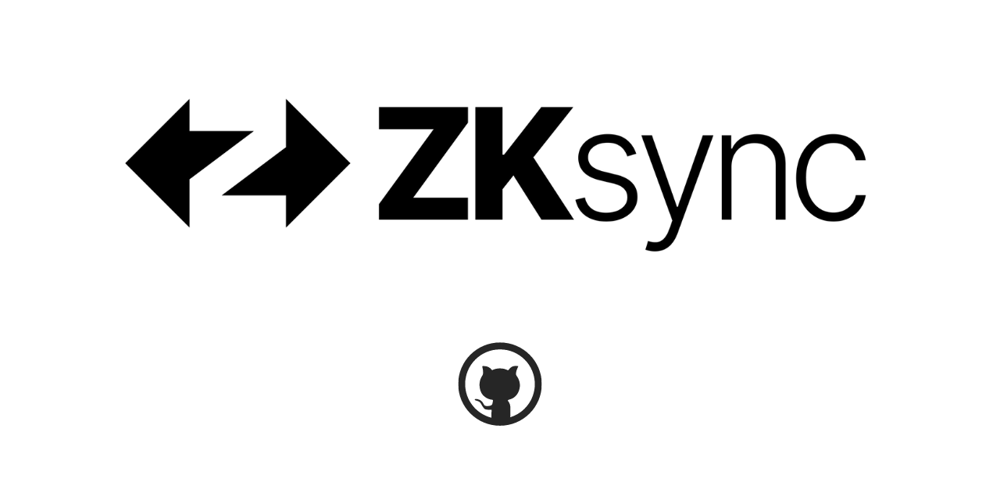

# ZKsync advanced zks RPC API example

> This is a [ZKsync](https://zksync.io) + [ethers v6](https://docs.ethers.org/v6/) + [Node.js](https://nodejs.org/) 
project in TypeScript bootstrapped with [`zksync-cli`](https://github.com/matter-labs/zksync-cli)

This project contains a basic script to retrieve transaction, block and batch advance information using the following RPC methods: `zks_getTransactionDetails`, `zks_getBlockDetails`, and `zks_getL1BatchDetails`

## Prerequisites

- [Node.js](https://nodejs.org/) v18.x or higher

## Getting Started

- Make sure to install the dependencies with `npm install`
- Run `npm run start` in your terminal to run the script.

## Learn more

To learn more about [ZKsync](https://zksync.io) or [ethers v6](https://docs.ethers.org/v6/), check out the following resources:

- [ZKsync Documentation](https://docs.zksync.io/build)
- [ethers v6 Documentation](https://docs.ethers.org/v6/)
